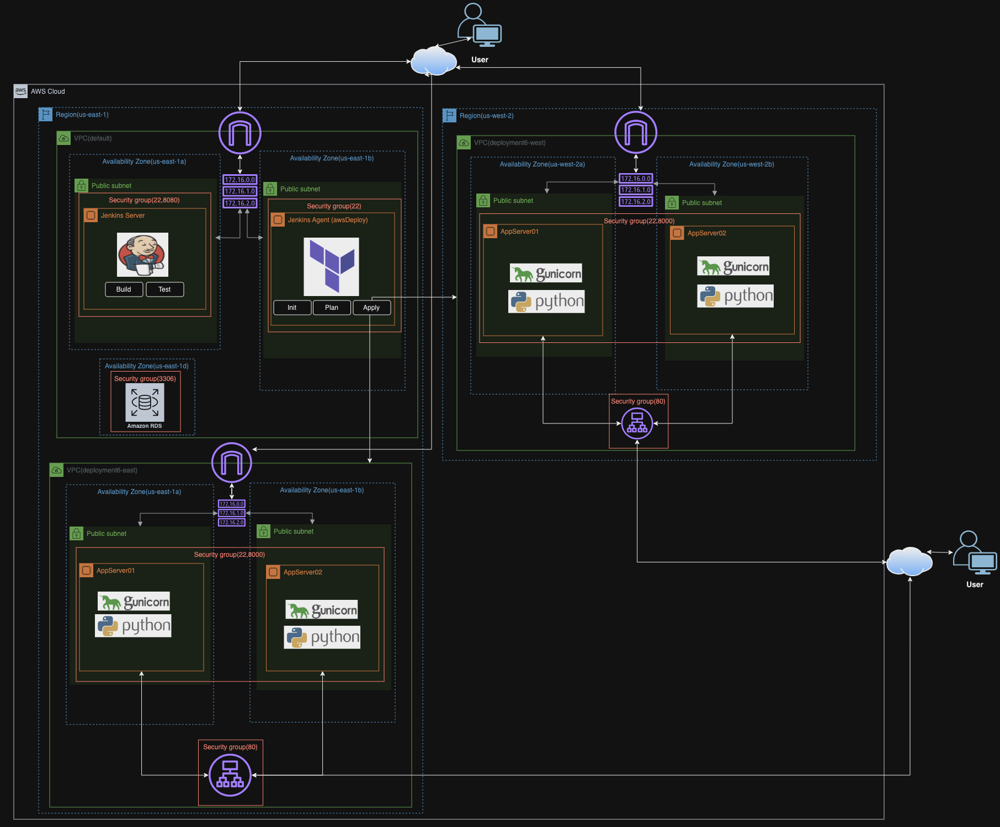

# Objective

Deploy a Python Flask application using Jenkins into a multi-region AWS infrastructure provisioned using Terraform

# Steps
1. Using terraform create your infrastructure for the following resources and place them in the [initTerraform Folder](initTerraform/)
- 2 Virtual Private Cloud(us-east-1, us-west-2)
- 2 Availability Zones per VPC
- 2 Public Subnets per VPC
- 2 EC2s per VPC
- 1 Route Table per VPC
- Security Groups per VPC
2. Install Jenkins on a server in your default VPC as well as:
- software-properties-common, add-apt-repository -y ppa:deadsnakes/ppa, python3.7, python3.7-venv, build-essential, libmysqlclient-dev, python3.7-dev
3. Configure a Jenkins agent and on the Jenkins agent server install:
- Terraform and default-jre
4. Create a user data script that will install the dependencies and deploy the application
- Dependencies: software-properties-common, add-apt-repository -y ppa:deadsnakes/ppa, python3.7, python3.7-venv, build-essential, libmysqlclient-dev, python3.7-dev
- Dependencies for virtual env: pip install mysqlclient, pip install gunicorn
5. Create an RDS instance using these [Instructions](https://scribehow.com/shared/How_to_Create_an_AWS_RDS_Database__zqPZ-jdRTHqiOGdhjMI8Zw)
6. Change the MySQL endpoints to your RDS instance in the following files `load_data.py`, `app.py`, `database.py`
7. Create Credentials in Jenkins to store your AWS Keys
8. Create a multibranch Pipeline and run the Jenkins Pipeline, check your application

9. Create an ALB in VPC in both regions and access the application using the provided DNS Record

# System Design

# Issues
- When creating multi-region infrastructure I had to create a separate provider in a different region and point the resources I wanted in the region to that provider.
- I was unable to destroy the terraform provisioned resources using the Jenkins Pipeline. I added a Terraform Destroy stage to the Jenkins file in order to do so.

# Optimization
- Place the RDS Database in a private subnet so it is not publicly accesible and create a read-replica if we notice that there is alot of read latency to the database or consider using an Aurora DB which has better performance than RDS and can be serverless
- Consider adding a CDN that can deliver static content of your application to your users with low latency
- Adding a Webserver tier can also be beneficial so it can be placed into a public subnet to handle requests and the application server can be placed into a private subnet
